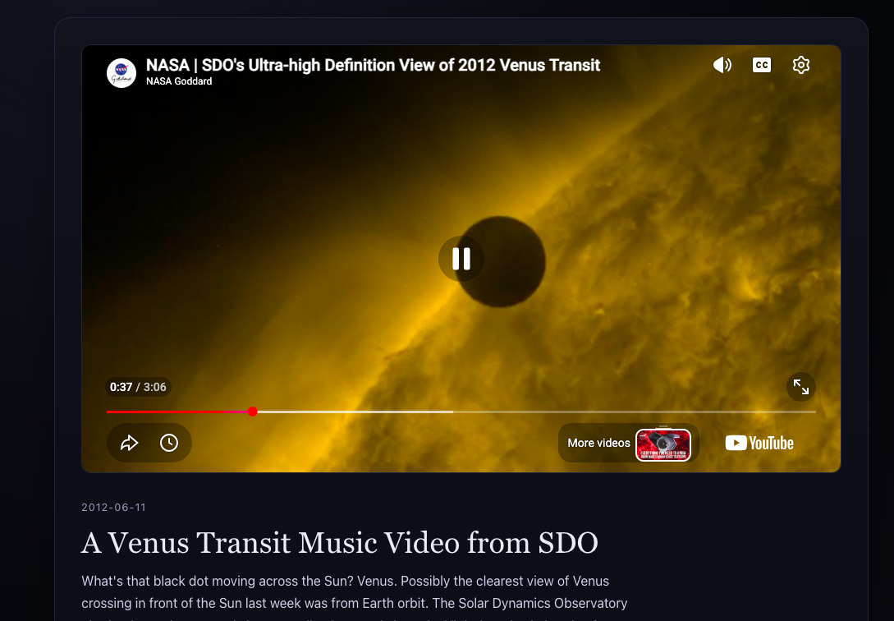

# NASA APOD

A small, beautiful window into NASA's Astronomy Picture of the Day.



## Description

NASA APOD takes NASA's public Astronomy Picture of the Day (APOD) API and turns it into a single, calm, image-first page: today's picture, its story, and simple controls to step through history — or land somewhere at random.

This is a fun personal project, not a platform.

## Features

* Today's Astronomy Picture of the Day, image or video
* Previous / Next day navigation, with no travel into the future
* **Surprise Me** — jumps to a random valid date since APOD began (1995-06-16)
* Graceful loading and error states
* Responsive, image-first layout for desktop, tablet, and mobile
* Accessible: semantic HTML, keyboard navigation, visible focus states, and reduced-motion support

## Tech Stack

* [Next.js](https://nextjs.org/) — App Router
* [React](https://react.dev/)
* [TypeScript](https://www.typescriptlang.org/) — strict mode
* [Tailwind CSS](https://tailwindcss.com/)
* [Jest](https://jestjs.io/) + [ts-jest](https://kulshekhar.github.io/ts-jest/)

## NASA APOD API

This app uses NASA's official Astronomy Picture of the Day API.

Requests are made server-side through a Next.js route handler at:

```text
app/api/apod/route.ts
```

This keeps the NASA API key out of the browser.

The underlying endpoint is:

```text
https://api.nasa.gov/planetary/apod
```

You can learn more about the API and obtain a free API key from [NASA's API website](https://api.nasa.gov/).

## Quick Start

### 1. Clone the repository

```bash
git clone https://github.com/ToshGitonga0/nasa-apod.git
cd nasa-apod
```

### 2. Install dependencies

```bash
npm install
```

### 3. Configure the NASA API key

Copy the example environment file:

```bash
cp .env.example .env.local
```

Open `.env.local` and add your NASA API key:

```env
NASA_API_KEY=DEMO_KEY
```

`DEMO_KEY` works for testing but has stricter rate limits. For regular use, create a free API key through [NASA's API website](https://api.nasa.gov/).

### 4. Start the development server

```bash
npm run dev
```

Then open http://localhost:3000 in your browser.

## Environment Variables

| Variable       | Description       | Default    |
| -------------- | ----------------- | ---------- |
| `NASA_API_KEY` | Your NASA API key | `DEMO_KEY` |

## Available Commands

| Command             | Description                                        |
| ------------------- | -------------------------------------------------- |
| `npm run dev`       | Start the local development server                 |
| `npm run build`     | Create a production build                          |
| `npm start`         | Run the production build                           |
| `npm run lint`      | Run ESLint                                         |
| `npm run typecheck` | Run the TypeScript compiler without emitting files |
| `npm test`          | Run the test suite                                 |

## Project Structure

```text
nasa-apod/
├── app/
│   ├── api/apod/route.ts   # Server-side NASA APOD proxy
│   ├── page.tsx            # The main page
│   ├── layout.tsx
│   ├── globals.css
│   └── home.css
├── components/
│   ├── ApodViewer.tsx / .module.css
│   ├── ApodImage.tsx / .module.css
│   ├── ApodDetails.tsx / .module.css
│   ├── ApodNavigation.tsx / .module.css
│   ├── ApodLoadingState.tsx / .module.css
│   └── ApodErrorState.tsx / .module.css
├── lib/
│   ├── nasa.ts              # Fetching + normalizing APOD responses
│   ├── dates.ts             # Calendar-date math, timezone-safe
│   └── types.ts             # APOD response types
└── __tests__/
```

## Versioning

This project follows [Semantic Versioning](https://semver.org/).

The current version is tracked in `package.json`.

## Changelog

See [CHANGELOG.md](./CHANGELOG.md).

## Attribution

Imagery and content are provided by NASA's Astronomy Picture of the Day ([APOD](https://apod.nasa.gov/)).

This project is not affiliated with or endorsed by NASA.

## License

MIT — do whatever you like with it.
